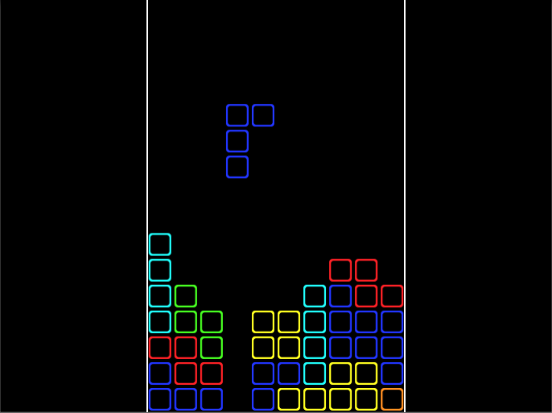

# Tetris
> A close recreation of the tile-matching puzzle video game owned by the Tetris Company.

[![Build Status][travis-image]][travis-url]

## Installation
Create a new Unity Project and then replace the Assets & Project Settings folders with the files from this repository in order to run this build.

## Instructions
Tetris was created in Unity3D and is a close recreation of the tile-matching puzzle video game owned by the Tetris Company. The game can only be played by one Player and ends when the Player is unable to make any further moves.

* Created using Unity3D and used MonoDevelop for scripting
* Based on a tutorial provided by www.noobtuts.com

## Meta
[Yamil Burgos](https://github.com/yamilburgos/) – yamil.burgos1293@gmail.com

## Contributing
1. Fork it (<https://github.com/yamilburgos/Tetris/fork>)
2. Create your feature branch (`git checkout -b feature/fooBar`)
3. Commit your changes (`git commit -am 'Add some fooBar'`)
4. Push to the branch (`git push origin feature/fooBar`)
5. Create a new Pull Request

<!-- Markdown link & img dfn's -->
[npm-image]: https://img.shields.io/npm/v/datadog-metrics.svg?style=flat-square
[npm-url]: https://npmjs.org/package/datadog-metrics
[travis-image]: https://img.shields.io/travis/dbader/node-datadog-metrics/master.svg?style=flat-square
[travis-url]: https://travis-ci.org/dbader/node-datadog-metrics